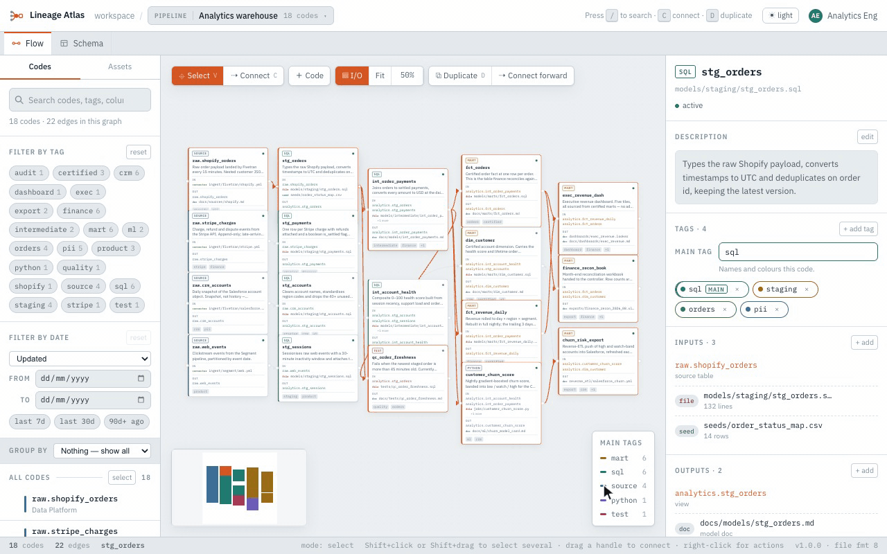
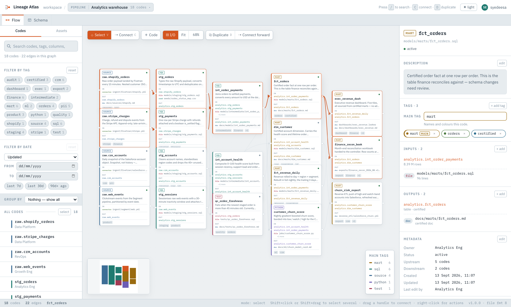
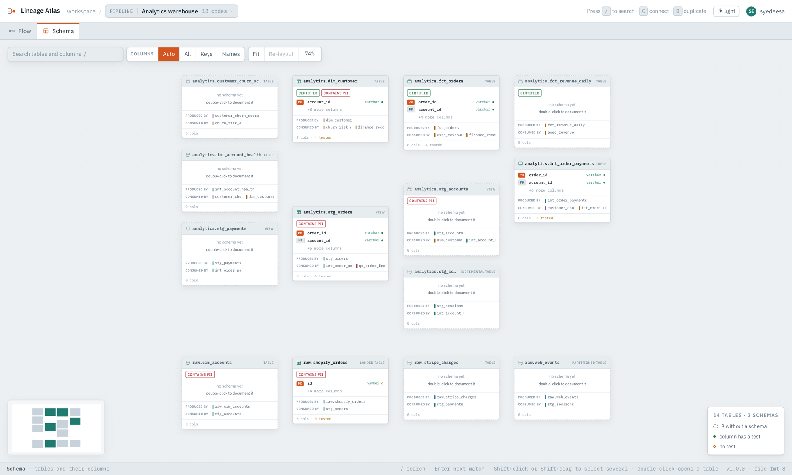
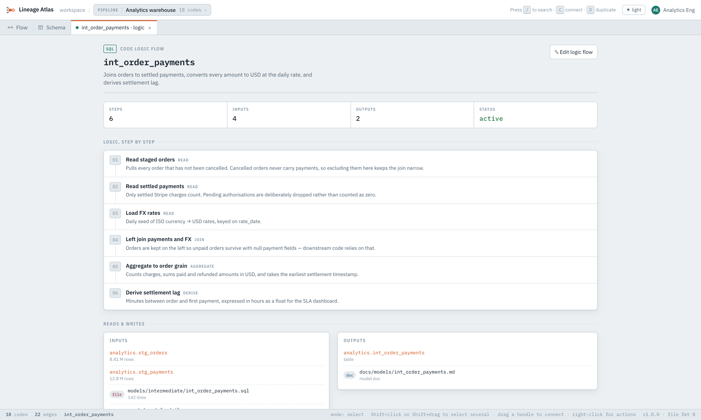
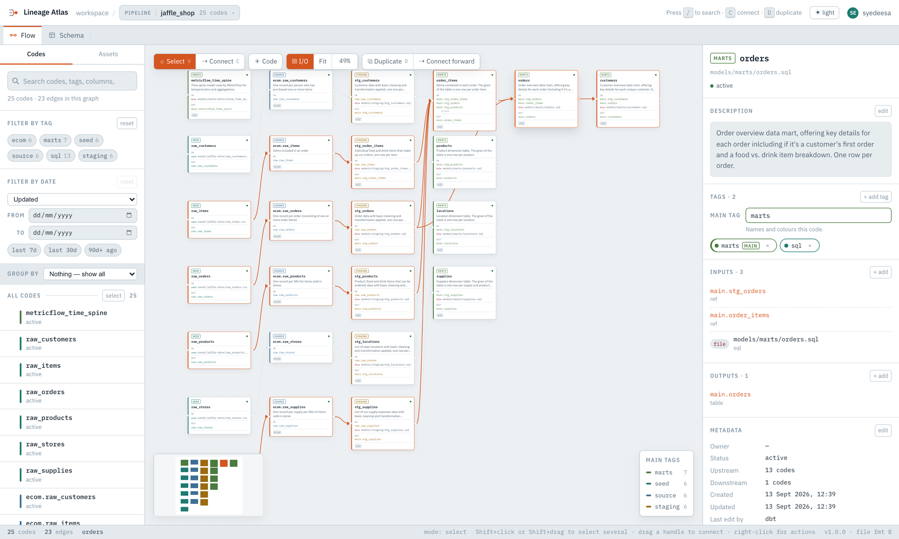

<div align="center">

<picture>
  <source media="(prefers-color-scheme: dark)" srcset=".github/assets/logo-dark.png">
  
</picture>

### Search a column name. See where it comes from and everything it feeds.

Import your dbt project with one command and get a searchable lineage graph, with
every table's columns and tests and each model's logic in plain English. It runs
locally. Then **let an AI agent document the pipeline, and review its work on the graph.**

[](LICENSE)


[Install](#installation) · [Import from dbt](#import-your-dbt-project) ·
[AI agents](#let-an-ai-agent-document-your-pipeline) · [Why](#why-lineage-atlas) ·
[Features](#features) · [Sharing](#sharing-pipelines-the-atlasjson-file) · [Docs](#documentation)

<br>



<sub>Search a column, land on the model that builds it, see everything upstream and downstream, then read what the model does. Recorded on the demo pipeline that loads on first start.</sub>

</div>

---

## Why Lineage Atlas

A data pipeline is a graph whether anyone draws it or not. Most teams keep its
documentation in places that can't represent a graph, and each of those places
fails in its own way:

| Where it lives today | What you get | What it costs you |
|---|---|---|
| **Diagramming tools** (draw.io, Lucidchart) | The shape, quickly | The arrows are only pictures. You can't search them, they carry no metadata, and the drawing quietly drifts away from reality. |
| **Wikis** (Confluence, Notion) | Detail a diagram can't hold | No structure. Tracing a value back four hops means opening four pages and keeping the path in your head. |
| **The code itself** | The only guaranteed truth | Hours of re-reading to rebuild the graph, every time, and the result lives in one person's head. |
| **Automated lineage scanners** | An accurate graph for free | They know what *ran*, not what it *means*, and there is nowhere for a person to write down what they know. |

Those gaps have real costs: hours of re-reading before you can safely change a
model, a table rebuilt when it already existed two schemas over, and a
dashboard nobody knew about breaking in production.

**Lineage Atlas replaces them with one tool.** You write down what each step
reads and writes, and the graph draws itself from that. The diagram, the
documentation and the search index are all the same thing.

### The problems it solves

| Question | Without Atlas | With Atlas |
|---|---|---|
| *Where does this column come from?* | Grep the repo, open every model, trace by hand | Search the column name, then walk the highlighted lineage |
| *What breaks if I change this model?* | Ask around and hope | Select it: every downstream consumer and its owner is shown |
| *Does this table already exist?* | Build it and find out later | Check the asset catalogue, which flags anything undocumented |
| *What does this step actually do?* | Read 200 lines of SQL | Read its prose logic flow, attached right to the node |
| *How do I hand this to someone new?* | A slide deck that's out of date by next week | Send one `.atlas.json` file |
| *Can I get started without drawing everything?* | No: every diagram tool starts blank | Import your dbt project's `manifest.json` in one command |

## The one idea: arrows follow from declarations

> `stg_orders` declares `analytics.stg_orders` as an **output**.
> `fct_orders` declares `analytics.stg_orders` as an **input**.
> So `stg_orders → fct_orders`. The edge appears on its own.

You record what each step reads and writes. You know that already, and it can
be checked. The shape of the graph follows from it. Each arrow has a precise
meaning: not "these are related" but "data flows from here to there, through
this named table."

The graph is kept **acyclic** on every write path. That guarantees questions like
"what does this depend on?" and "what breaks if I change this?" always finish
with an answer. → [docs/CONCEPTS.md](docs/CONCEPTS.md)

## Features

<table>
<tr>
<td width="50%" valign="top">

### 🔎 Search that reaches into the docs
Search matches names, descriptions, owners, tags and I/O paths. It also matches
the **column names** a step produces and the **text of its logic flow**. Search
`settlement_lag_hours` and you find the model that creates it, without knowing
which model that is.

### 🧭 One-click lineage
Select any step and everything upstream and downstream highlights while the rest
dims. The inspector counts the steps upstream and downstream and shows the owner,
so you know who to tell before you change something.

### 🗂️ Asset catalogue
Every table lists its producer, column count, test coverage and consumers.
Anything without a documented schema is flagged, which answers "does this data
already exist?" before anyone rebuilds it.

</td>
<td width="50%" valign="top">

### 📐 Schema view
Every table in the pipeline laid out with columns, types, PK/FK badges and a
test-coverage dot per column, grouped by schema. Undocumented tables are drawn
dashed, so the gaps are hard to miss.

### 📝 Prose logic flows
Explain what a model does, step by step, right on the node instead of on a
separate wiki page. **No source code is ever captured**, which keeps a file safe
to share outside the repo.

### 📦 One-file sharing
Export any pipeline as a self-contained, versioned `.atlas.json` file. It is
small enough to paste into a chat and can be validated in CI. Older files are
always upgraded on import.

</td>
</tr>
</table>

Also included: **dbt import** (models, sources, tests and owners from
`manifest.json`, column types from `catalog.json`); free-form **tags** instead
of fixed types (a tag always gets the same colour, derived from its text); **stewardship** fields (owner, created,
updated, last edited by) on every record; **date filters** to find stale
documentation; any number of **isolated pipelines** in one install; **light and
dark** themes; and a full **REST API** that drives everything the UI can do.

## Screenshots

<picture>
  <source media="(prefers-color-scheme: dark)" srcset=".github/assets/flow-dark.png">
  
</picture>
<p align="center"><sub><b>Flow.</b> Select a step and its whole upstream and downstream path lights up.</sub></p>

<table>
<tr>
<td width="50%">

<p align="center"><sub><b>Schema.</b> Every table, its columns, keys and test coverage.</sub></p>
</td>
<td width="50%">

<p align="center"><sub><b>Logic flow.</b> What a step does and why, in prose.</sub></p>
</td>
</tr>
</table>

## Installation

### Requirements

- **Node.js 24 or newer.** Atlas uses the built-in `node:sqlite` module, which
  first shipped unflagged in Node 24. Check with `node --version`.
- That's all. There's no database server, no native compiler toolchain and no
  Docker.

> [!NOTE]
> Lineage Atlas is **not on npm yet**, so `npx lineage-atlas` and
> `npm install -g lineage-atlas` won't work. For now, install from source using
> the steps below. It takes about a minute.

### 1. Clone and install

```bash
git clone https://github.com/eesa-syed/lineage-atlas.git
cd lineage-atlas
npm install
```

### 2. Run it

| Mode | Command | Open | Best for |
|---|---|---|---|
| **App** | `npm run build && npm start` | <http://localhost:5174> | Using Atlas. One process, one port, and the API serves the built UI. |
| **Development** | `npm run dev` | <http://localhost:5173> | Changing Atlas. Hot reload, with Vite proxying `/api` to the API on `5174`. |

The first start creates the database and loads a demo analytics warehouse, so
you have something to explore right away.

### 3. Optional: install the `lineage-atlas` command

To run Atlas from any folder, like an installed tool, install your built
checkout globally:

```bash
npm run build
npm install -g .
lineage-atlas            # starts the app and opens your browser
```

This links the command to your checkout, so after a `git pull`, running
`npm run build` is all it takes to update. Because it still runs from the
checkout, it keeps using the checkout's `data/atlas.db` and port `5174`. Pass
`--db <file>` to keep your pipelines somewhere else. Run
`npm uninstall -g lineage-atlas` to remove it.

### Verify it's running

```bash
curl -s localhost:5174/api/version
# {"name":"lineage-atlas","version":"1.0.0","bundleFormat":"lineage-atlas.pipeline","bundleVersion":8,...}
```

## Import your dbt project

Already use dbt? Skip drawing and see your own project in about 30 seconds:

```bash
cd your-dbt-project
dbt docs generate      # writes target/manifest.json and target/catalog.json
lineage-atlas import target/manifest.json --catalog target/catalog.json
```

That uses the `lineage-atlas` command from
[step 3](#3-optional-install-the-lineage-atlas-command). Without it, run this
from your Atlas checkout instead, with absolute paths:
`npm run import -- /path/to/target/manifest.json --catalog /path/to/target/catalog.json`.

Or, in the app, open the pipeline switcher, choose *Import from file…*, and
select both files together.

Every model, source, seed, snapshot and exposure becomes a step. Dependencies
become edges, and each model folder (`staging`, `marts`) gets its own colour.
Tables get their columns, types and dbt tests, and owners come from `meta.owner`
or dbt groups. No SQL is copied. → [docs/DBT.md](docs/DBT.md) has the full
mapping.

<picture>
  <source media="(prefers-color-scheme: dark)" srcset=".github/assets/dbt-jaffle-shop-dark.png">
  
</picture>

<p align="center"><sub>dbt-labs' <a href="https://github.com/dbt-labs/jaffle-shop">jaffle-shop</a>, imported from its <code>manifest.json</code> and <code>catalog.json</code> with no edits. The <code>orders</code> mart is selected.</sub></p>

## Let an AI agent document your pipeline

Imported dbt models arrive with their structure but no explanation of *why* they
exist. Writing that is slow for people and quick for an agent, but an agent's
confident mistakes are hard to spot in a wall of text. **On a graph they're easy
to spot:** a wrong dependency sits next to everything it connects to, and every
edit the agent made is one filter click away.

Atlas ships a **Claude Code skill** that teaches an agent the whole workflow:
importing, tracing, writing logic flows, and tagging its own work for review.

**1. Make the skill available.** It's already active when you run Claude Code
inside this repository. To use it from your dbt project, copy it into your
personal skills:

```bash
cp -r .claude/skills/lineage-atlas ~/.claude/skills/
```

**2. Ask for the work.** With Atlas running, from your dbt project folder:

> *Import target/manifest.json into Lineage Atlas. Then, for every model in
> `marts/`, read its SQL and write a logic flow that explains what it does and
> why. Tag each model you document `agent_drafted`.*

**3. Review it on the graph.** Click the `agent_drafted` tag chip, and the canvas
dims everything the agent didn't touch. Open each model and check its logic
against its inputs and outputs. Fix what's wrong, and remove the tag once it's
right.

The skill also covers questions you'd otherwise answer by reading the repo:
*"Where does `lifetime_spend` come from?"*, *"What breaks if I change
`stg_orders`?"*, *"Does a customer dimension already exist?"*

It isn't tied to Claude. Everything the skill uses is a plain REST API over the
same model the UI edits, so any agent or script can do the same. →
[docs/AI_AGENTS.md](docs/AI_AGENTS.md) covers the API and the rules that keep an
agent from quietly degrading a graph.

## Quick start

1. **Explore the demo.** Click any step on the canvas and watch its lineage light
   up. Try searching for a column name like `order_id`.
2. **Create your own pipeline.** Open the pipeline switcher in the top bar and
   choose *New empty pipeline*.
3. **Add a step.** Click **＋ Code**, give it a name and a tag such as `sql`.
4. **Declare what it reads and writes.** In the inspector, use `+ add` under
   *Inputs* and *Outputs*. When two steps share a table name, the arrow between
   them is drawn automatically.
5. **Document it.** Double-click a step to write its logic flow, or click a table
   to document its columns.
6. **Share it.** Open the pipeline switcher and choose *Export this pipeline*.

The [user guide](docs/USER_GUIDE.md) covers every interaction and keyboard
shortcut.

## Configuration

Every setting works as a command-line flag or an environment variable.

| Flag | Environment | Default | Purpose |
|---|---|---|---|
| `--port <n>` | `ATLAS_PORT` | `5174` | Port to listen on. When set, only that port is tried, so scripts fail loudly instead of starting somewhere unexpected. |
| `--db <file>` | `ATLAS_DB` | see below | The SQLite database file. Use a separate file for each atlas you want to keep. |
| `--no-open` | `ATLAS_NO_OPEN` | off | Don't open a browser (`serve` never opens one). |
| — | `ATLAS_HOST` | `127.0.0.1` | Network interface to bind. Only this machine can connect by default. |
| — | `ATLAS_ALLOWED_HOSTS` | — | Comma-separated host names to accept besides `localhost`, when serving a team. |
| — | `ATLAS_USER` | OS user | The name recorded as *last edit by* for changes made on this machine. |

If the port isn't pinned and `5174` is busy, an **installed** copy moves to the
next free port and prints where it landed. A **source checkout** refuses to
start instead, because its dev server proxies to `5174` specifically.

### Where your data lives

The database is created and seeded on first start, and the startup line always
prints its path.

| Running from | Database location |
|---|---|
| Source checkout | `data/atlas.db` (gitignored) |
| Installed, macOS | `~/Library/Application Support/lineage-atlas/atlas.db` |
| Installed, Linux | `$XDG_DATA_HOME/lineage-atlas/atlas.db`, else `~/.local/share/lineage-atlas/atlas.db` |
| Installed, Windows | `%APPDATA%\lineage-atlas\atlas.db` |

## Command-line reference

| Command | What it does |
|---|---|
| `lineage-atlas` | Start the app and open it in a browser |
| `lineage-atlas serve` | Start the app without opening a browser |
| `lineage-atlas list` | List pipelines with their code and edge counts |
| `lineage-atlas export <id> [file]` | Write a pipeline to an `.atlas.json` file |
| `lineage-atlas validate <file>` | Check a file without importing it (exits `1` if it would be refused) |
| `lineage-atlas import <file> ["Name"]` | Import an `.atlas.json` or dbt `manifest.json` as a **new** pipeline (add `--catalog catalog.json` for column types) |
| `lineage-atlas from-dbt <manifest.json> [file]` | Convert a dbt project to an `.atlas.json` file without importing it |
| `lineage-atlas version` | Print the app and file-format versions |

<details>
<summary><b>Repository scripts</b> (source checkout)</summary>

| Command | What it does |
|---|---|
| `npm run dev` | API and web dev server together |
| `npm run build` | Check versions, then type-check and build both workspaces |
| `npm start` | Run the built server |
| `npm run seed` | Wipe and reload the demo warehouse pipeline |
| `npm run pipelines` | List pipelines with their code and edge counts |
| `npm run export -- <id> [file]` | Write a pipeline to an `.atlas.json` file |
| `npm run validate -- <file>` | Check a file without importing it |
| `npm run import -- <file> ["Name"]` | Import an `.atlas.json` or dbt `manifest.json` as a new pipeline |
| `npm run from-dbt -- <manifest.json> [file]` | Convert a dbt project to an `.atlas.json` file |
| `npm run typecheck` | Type-check without emitting |

</details>

## Sharing pipelines: the `.atlas.json` file

A pipeline exports to **one self-contained JSON file** that any other copy of
Atlas can import. It holds the steps, edges, tags, inputs, outputs, table schemas
and logic flows. It never holds source code, credentials or row data, so it stays
small and is safe to share with someone who can't see the repository.

```bash
lineage-atlas export   warehouse                                 # → analytics-warehouse-2026-09-13.atlas.json
lineage-atlas validate analytics-warehouse-2026-09-13.atlas.json
lineage-atlas import   analytics-warehouse-2026-09-13.atlas.json "Warehouse (from Priya)"
```

```jsonc
{
  "format": "lineage-atlas.pipeline",      // always this value
  "formatVersion": 8,                      // the file format, not the app version
  "generator": { "name": "lineage-atlas", "version": "1.0.0" },
  "exportedAt": "2026-09-13T05:37:22Z",
  "counts": { "codes": 18, "edges": 22, "assets": 14 },
  "pipeline": { "name": "Analytics warehouse", "description": "…" },
  "codes":  [ /* steps: tags, inputs/outputs, logic-flow steps */ ],
  "edges":  [ /* { "source": "<code id>", "target": "<code id>" } */ ],
  "assets": [ /* tables: columns, keys, tests, producer */ ]
}
```

**Backward compatible, forward refusing:**

- **Older files are upgraded** on import, one format version at a time, and every
  upgrade step is reported. Formats 1 through 8 all import.
- **Files from a newer build are refused** with a message naming both versions,
  rather than guessed at.
- **Import always creates a new pipeline.** Ids are local to the file and
  remapped, so importing the same file twice never collides or overwrites.
- **Meaningless files are refused before anything is written.** Files with a safe
  reading (a dangling reference, a duplicate edge, an edge that would create a
  cycle) import whole, and every repair is reported.

`validate` runs that exact check and writes nothing, so you can use it as a CI
gate. → [docs/FILE_FORMAT.md](docs/FILE_FORMAT.md) is the full specification, and
the place to start if you want to generate files from another tool.

## Architecture

```text
┌──────────────────────────┐   /api (JSON)   ┌───────────────────────────┐
│  web/  React + Vite      │ ──────────────▶ │  server/  Express         │
│  React Flow canvases     │                 │  node:sqlite (built in)   │
│  Zustand store           │ ◀────────────── │  bundle import/export     │
└──────────────────────────┘                 └─────────────┬─────────────┘
                                                           │
                             bin/lineage-atlas.mjs     atlas.db (SQLite)
                             serve · list · export · validate · import
```

<details>
<summary><b>Repository layout</b></summary>

```text
server/   Express + node:sqlite API
  src/version.ts      app version, file-format version, minimum readable format
  src/db.ts           schema, migrations, connection, tiny query helpers
  src/repo.ts         reads, mutations, pipeline CRUD, I/O and logic-flow writes
  src/bundle.ts       .atlas.json export, the upgrade ladder, validation, import
  src/dbt.ts          dbt manifest.json (+ catalog.json) → .atlas.json translator
  src/cli.ts          list / export / validate / import from the terminal
  src/paths.ts        checkout vs. installed: where the database lives
  src/security.ts     loopback binding, Host/Origin checks, response headers
  src/seed*.ts        the demo warehouse: codes, schemas, logic-flow steps
  src/index.ts        routes
web/      React + TypeScript + Vite + React Flow
  src/state/store.ts  all app state and every server call
  src/components/     shell, rail, both canvases, table node, inspector, menus
  src/lib/            lineage walks; the Schema tab's grid layout and search
  src/panes/          the logic-flow and schema documents
  src/styles/         design tokens, then everything built from them
bin/lineage-atlas.mjs the installed command: serve, or the file CLI
docs/                 concepts, user guide, file-format spec, agent guide
```

</details>

## Security model

Atlas is a **single-user, local-first** tool with no login system.

- It binds to `127.0.0.1` by default, so only your machine can reach it.
- Requests with a foreign `Origin` or `Host` header are refused. This stops other
  websites open in your browser from reading or editing your pipelines, including
  through DNS rebinding.
- To serve a team, set `ATLAS_HOST` and `ATLAS_ALLOWED_HOSTS`, and only do that on
  a network you trust. Anyone who can reach the API can edit it.

Found a vulnerability? Please report it privately. [SECURITY.md](SECURITY.md)
explains how.

## Scope and limitations

Atlas deliberately stays small. It is **not**:

- **An orchestrator.** It never runs anything.
- **An automatic lineage scanner.** The graph is written by people. That's the
  trade: it can capture intent, which a parser can't recover, and it can be
  wrong, which a parser can't be.
- **A merge tool.** Import always creates a new pipeline. Merging would need a
  conflict policy for every step.

Known gaps, and contributions welcome:

- Re-importing a dbt project creates a fresh pipeline. There's no merge that
  keeps hand-written notes while updating the structure underneath.
- No importers for other tools yet (Airflow, Dagster, SQLMesh).
  [The format spec](docs/FILE_FORMAT.md) is written for exactly this.
- The web UI doesn't identify its user, so browser edits are attributed to
  `ATLAS_USER` or the OS user. Scripts and agents should send an `X-Atlas-User`
  header.
- Owner isn't on the create forms, and a pipeline's description can only be set
  through the API.
- Inferred links are additive: removing a shared table name doesn't delete the
  edge it created.
- No automated test suite yet. `npm run validate` against a fixture is the
  current check for format changes.

## Documentation

| Document | What's inside |
|---|---|
| [User guide](docs/USER_GUIDE.md) | Every interaction, the keyboard shortcuts, and notes on the design |
| [Importing from dbt](docs/DBT.md) | How dbt models, sources, tests and owners map into Atlas |
| [Concepts](docs/CONCEPTS.md) | The model, and why it's shaped this way |
| [File format](docs/FILE_FORMAT.md) | The formal `.atlas.json` spec, for anyone writing a producer |
| [AI agents](docs/AI_AGENTS.md) | Driving Atlas from an agent: API surface and rules |
| [Project documentation](PROJECT_DOCUMENTATION.md) | Full codebase tour: architecture, data model, every route |
| [Contributing](CONTRIBUTING.md) | Setup, conventions, how to change the file format |
| [Changelog](CHANGELOG.md) | What changed, and what breaks |

## Contributing

Issues and pull requests are welcome. [CONTRIBUTING.md](CONTRIBUTING.md) covers
setup, the conventions worth knowing, and the process for changing the file
format. Everyone taking part is asked to follow the
[Code of Conduct](CODE_OF_CONDUCT.md).

## License

[MIT](LICENSE)
