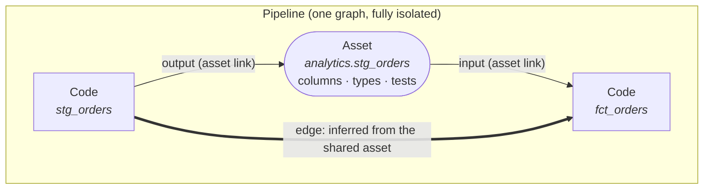

# Concepts: the pipeline as a graph you can query

This explains the model Lineage Atlas is built on, and why it is shaped this
way. [FILE_FORMAT.md](FILE_FORMAT.md) is how the model is serialised;
[AI_AGENTS.md](AI_AGENTS.md) is how an agent works inside it.

---

## 1. The problem this is for

A data pipeline is a graph whether or not anyone draws it. What teams usually
have instead is:

- **A diagram** — draw.io, Lucidchart, a whiteboard photo. It shows the shape,
  and that is all it does. The arrows are pictures. You cannot search it for a
  column name, you cannot ask what breaks if a table changes, and it starts
  drifting from reality the day after it is drawn, silently.
- **A wiki page** — Confluence, Notion, a README. It holds the detail the diagram
  cannot, but the structure is gone: the graph lives in prose, spread across
  pages that link by hand. Tracing a value back through four hops means opening
  four pages and holding the path in your head.
- **The code itself** — the only thing guaranteed to be true, and the most
  expensive thing to read. Reconstructing the graph from SQL and DAG definitions
  is hours of work, and the result lives in one person's head until they forget
  it or leave.

The costs are specific and familiar. Hours spent re-deriving what a pipeline
does before you can safely change anything. Losing track of which models you
already touched partway through a change. Building a table that already exists
two schemas over, because nothing made it findable. Breaking a downstream
consumer nobody knew was there.

Automated lineage tools solve part of this by parsing warehouse logs and
producing a graph nobody authored. That graph is accurate about *what ran* and
silent about *what it means* — and being generated, it is not somewhere a person
can comfortably write down what they know. The understanding still has nowhere to
live.

**Atlas takes the position that the diagram, the documentation, and the
searchable index should be the same object** — a graph you can read at a glance,
search by column name, walk in both directions, and edit by hand.

## 2. The five things in the model

**Code** — one documented step. A source table, a SQL model, a Python job, a
mart, a quality check: anything that reads and/or writes data. It carries a name,
a description, an owner, an active/inactive status, ordered tags, and a **logic
flow**: prose steps saying what it does internally. No source code is ever
captured or stored.

**Asset** — a documented thing that codes read and write, and the schema page
behind a name: columns with types, keys, nullability, tests and descriptions,
plus sample rows and both directions of its lineage.

**Stewardship** — codes and assets both carry the same four fields: an **owner**
(the team answerable for the thing), when the record was **created** and last
**updated**, and **who** made that last edit. Two of them you set; two of them
the act of editing sets for you.

The dates belong to the documentation, not to the data. Nothing in Atlas watches
a warehouse, so `updated` is never a freshness signal — it is the answer to a
different and more useful question: *when did anyone last check that this page
is still true?* A mart loaded every fifteen minutes whose description was last
touched in February is a mart nobody has read in seven months, and that is
precisely what the field is for. `updatedBy` is attribution in the sense a git
author line is: nothing verifies it and nothing is gated on it.

All four are editable, which matters most when documentation arrives from
somewhere else — a backfill can date a record to when it was really written
instead of to the afternoon it was imported. The rule that keeps that coherent:
what you type wins for that save, and the next ordinary edit goes back to
stamping, because at that point `updatedAt` is once again simply the truth
about the page.

**Asset link** — one declaration on one code: *this code reads `X`* or *this code
writes `Y`*. A link is just a path, an optional detail and its own tags. When it
names something in the catalogue it resolves to an **asset** and gains a schema.

**Edge** — an arrow between two codes. Normally you never draw one (§3).

**Pipeline** — one graph, fully isolated. An installation holds any number of
them — a warehouse, a marketing graph, an ML pipeline. Edges cannot cross
between pipelines, and two pipelines can hold assets with the same name without
colliding.

**Tags** are the only classification. There is no fixed code type and no fixed
set of layers: invent whatever words suit your pipeline. The first tag is the
*main tag* — it names and colours the code on the canvas. Colour is derived from
the tag's own text, so the same tag is the same colour on every machine with
nothing stored anywhere.

## 3. Arrows are consequences, not drawings

This is the difference that matters most, and it is the whole reason the tool is
not a diagram editor.

In a drawing tool, an arrow is a line you drew. It means whatever you remember it
meaning. Nothing checks it, and nothing updates it.

In Atlas, an arrow is **derived from two declarations**:

> `stg_orders` declares `analytics.stg_orders` as an **output**.
> `fct_orders` declares `analytics.stg_orders` as an **input**.
> Therefore `stg_orders → fct_orders`. The edge is drawn for you.

You document what each step reads and writes — which is knowledge you have
anyway, and which is *checkable* — and the topology falls out. Add a code that
reads a table and it wires itself into the graph on the spot. *Rebuild links from
inputs & outputs* re-derives a whole pipeline at once.

Three properties follow:

- **The arrow means something precise.** Not "these are related" but "this data
  flows from here to there," with a named asset on the arrow.
- **The graph is hard to get wrong** in the way a drawing is, because you are not
  maintaining the topology by hand. It is a projection of the declarations.
- **An asset has one producer** — the first code to declare it as an output. Two
  codes claiming to produce one table is a real problem, so the app warns rather
  than quietly accepting it. (This is also why a duplicated code never inherits
  the original's produced asset: two producers of one table would be a lie.)

Manual edges still exist — drag between two handles — for the flows an asset name
cannot express. They pass the same checks.

## 4. Why a DAG, strictly

The graph is **acyclic, always**, and this is enforced on every path into it: a
manual edge that would close a loop is refused with an explanation, an inferred
edge is skipped silently (the declaration is still recorded — only the arrow is
omitted), and an imported file has its cycle-forming edges dropped with a
warning.

Acyclicity is not pedantry. It is what makes the questions answerable:

- **"What does this depend on?"** terminates. Walking upstream from any code
  reaches sources and stops. In a cyclic graph it does not.
- **"What breaks if I change this?"** terminates too, walking the other way.
- **Ordering is meaningful.** Upstream is genuinely earlier. If A is upstream of
  B, then B is not upstream of A, and reasoning built on that never contradicts
  itself.
- **"Where did this value come from?"** has one answer per hop rather than a loop
  to unwind.

A cycle in a pipeline graph nearly always means a mistake — a mis-declared input,
or two things that should have been one. Refusing it turns a subtle wrong picture
into an immediate, located error.

## 5. Tracing back

Selecting a code computes its **lineage set**: itself, everything upstream, and
everything downstream. Everything in it highlights; everything else dims. One
click answers "what is this connected to, in both directions, transitively."

That is the fast path. The others:

- **Search matches more than names.** The rail's search box matches a code's
  name, description, owner, tags and I/O paths — *and* the column names of the
  asset it produces, *and* the text of its logic-flow steps. Searching
  `settlement_lag_hours` finds the model that produces that column without you
  knowing which model that is. This is the direct answer to "the diagram is not
  searchable": the index is built server-side from the documentation itself, so
  it cannot drift from it.
- **Every schema page shows both directions.** An asset names its producer and
  every code that consumes it, each a link back onto the canvas.
- **The asset catalogue is the "does this already exist?" answer.** The Assets
  tab lists every asset in the pipeline with its producer, column count, how many
  columns carry tests, and how many codes read it, flagging anything with no
  schema yet. Checking before you build a table takes seconds instead of being
  the thing nobody thinks to do.
- **The graph is the worklist.** Tags are free-form, so `needs_review` or
  `migrating_q3` is a filter chip in the rail the moment you use it once. The set
  of files you have worked on is a tag, and it survives you closing your laptop.
- **The date window finds the documentation nobody has revisited.** Filter
  either list by when a record was created or last updated — `90d+ ago` is the
  stale end of the pipeline in one click. Because the rail's filters also dim
  the canvas, "what has been left alone since June" is a shape on the graph:
  usually a whole limb of it, which is the part worth reading before you trust
  anything downstream of it.

## 6. Documentation attached to structure

A code's **logic flow** is its ordered prose steps: an operation, a title and an
explanation each. An asset's **schema** is its columns, keys and tests — its
shape, never its contents.

Both are ordinary documentation. The difference from a wiki is only where they
live: attached to a node in a graph rather than on a page in a tree. That single
change is what makes them navigable — you arrive at the explanation by clicking
the thing it explains, from a picture of how that thing relates to everything
else, rather than by searching a wiki for a page whose title you have to guess.

**No source code is captured**, deliberately. Prose says why; the repository
already says how, and a copy of it here would be wrong within a week. It also
means an Atlas file is safe to hand to someone who cannot see the repository, and
small enough to paste into a chat message.

## 7. Built for two kinds of reader

Everything in Atlas is reachable three ways: the UI, a REST API, and a single
self-contained file. They are the same model, so a person and an agent can work
on the same pipeline without a translation layer between them.

- **A person** gets a canvas: colour that carries information, search, lineage
  highlighting, keyboard shortcuts, editable prose.
- **An agent** gets a small, complete REST API and a JSON file it can read and
  write. The graph is a far better substrate for an agent than a repository is:
  the dependencies are explicit, the traversal terminates, and every node has a
  written description of what it is for.

Neither is a second-class path, and that is the point. An agent can trace a
column back to its source and propose the change; a person can see the proposal
in context and decide. The graph is the shared artefact they argue over — which
is much easier when both are looking at the same picture.

See [AI_AGENTS.md](AI_AGENTS.md) for how that works in practice.

## 8. What Atlas is not

- **Not an orchestrator.** It never runs anything. Airflow, Dagster and dbt run
  pipelines; Atlas documents them.
- **Not an automatic lineage scraper.** Nothing parses your warehouse logs. The
  graph is authored, which is the trade: it can hold intent, which a parser
  cannot recover, and it can be wrong, which a parser cannot be. *Rebuild links*
  and column-level search exist to keep the cost of staying honest low.
- **Not a source-code viewer.** See §6.
- **Not multi-user.** There is no auth, no permissions and no history. It is a
  single-tenant tool; sharing happens by handing someone a file.
